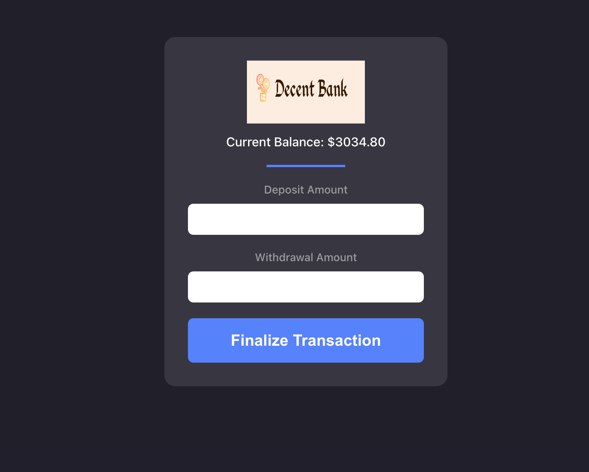

# dbank--Decent Bank
> This Decentralized Bank project is part of Angela Yu's Web Dev course
> Live demo to be posted later with additional functionality

<!-- > Live demo [_here_](https://www.example.com). If you have the project hosted somewhere, include the link here. -->

## Table of Contents
* [General Info](#general-information)
* [Technologies Used](#technologies-used)
* [Features](#features)
* [Screenshots](#screenshots)
* [Setup](#setup)
* [Usage](#usage)
* [Project Status](#project-status)
* [Room for Improvement](#room-for-improvement)
* [Acknowledgements](#acknowledgements)
* [Contact](#contact)
* [Motoko/IC Recourses](#resources)
<!-- * [License](#license) -->

## General Information
- The purpose of this app is to learn how to create an app on the Internet Computer using Motoko as a backend 
<!-- You don't have to answer all the questions - just the ones relevant to your project. -->

## Technologies Used
- Tech 1 - Motoko
- Tech 2 - Vanilla JS
- Tech 3 - CSS/HTML

## Features
List the ready features here:
- Deposit/ Withdrawal functionality
- Orthogonal Persistance
- More to follow

## Screenshots

## Setup
To install dfx, run:

`sh -ci "$(curl -fsSL https://internetcomputer.org/install.sh)"`

To verify that dfx properly installed, run:

`dfx --version`

## Usage

1. Start excution environment (run in background or open a new terminal after you execute this command).

`dfx start`

If you open a new terminal, leave the other terminal the excution environment (dfx start) running. 

2. Install dependencies:

`npm install`

3. Deploy the Decent Bank app.

`dfx deploy`

4. Start the development server.

`npm start`

## Project Status
Project is: _in progress_ 

## Room for Improvement

- modal confirmation when transaction button is pressed
- make the app in to a 100% React app

To do:
- css for modal
- html for modal

## Acknowledgements
This course is part of [Angela Yu's bootcamp](https://appbrewery.com/p/the-complete-web-development-course).

## Contact
Created by [@celalkincross](https://celalkincross.github.io/) - feel free to contact me!

<!-- Optional -->
<!-- ## License -->
<!-- This project is open source and available under the [... License](). -->

<!-- You don't have to include all sections - just the one's relevant to your project -->

## Resources

- [Quick Start](https://internetcomputer.org/docs/current/developer-docs/quickstart/hello10mins)
- [SDK Developer Tools](https://internetcomputer.org/docs/current/developer-docs/build/install-upgrade-remove)
- [Motoko Programming Language Guide](https://internetcomputer.org/docs/current/developer-docs/build/cdks/motoko-dfinity/motoko/)
- [Motoko Language Quick Reference](https://internetcomputer.org/docs/current/references/motoko-ref/)
- [JavaScript API Reference](https://erxue-5aaaa-aaaab-qaagq-cai.raw.ic0.app)

